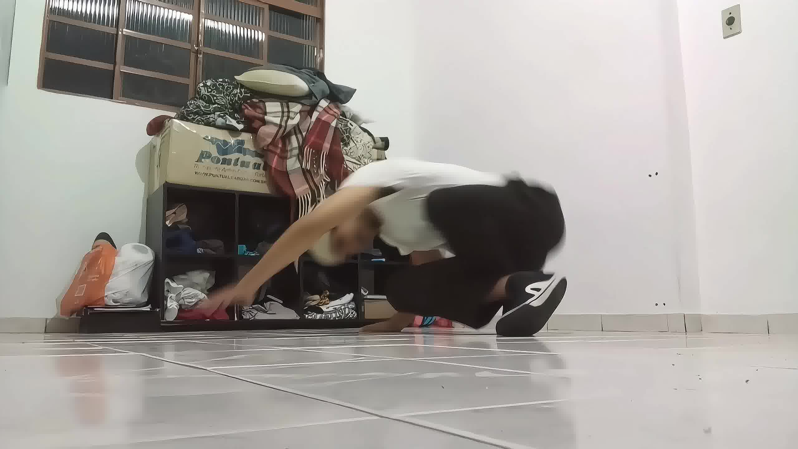
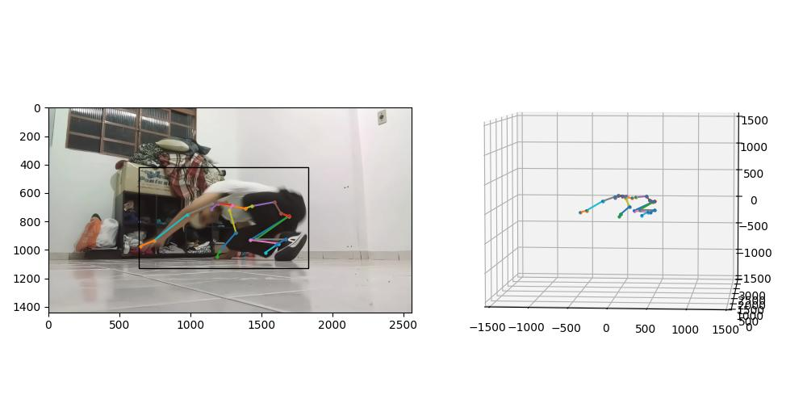

# Pose estimation ETL

This pipeline produces a copy of the original video projecting the 3d pose estimation produced by the cv model MeTRAbs (https://doi.org/10.48550/arXiv.2007.07227).

## Exemple

### input video

[](./data_output/Vmake-1705538964483/Vmake-1705538964483.mp4)

### output video
[](data_output/Vmake-1705538964483/video.mp4)

## How to install

If you are an Unix system based user, just follow these steps
```
$ git clone https://github.com/almeidadm/pose_estimation.git
$ cd pose_estimation
$ python -m venv .venv
$ source ./source/bin/activate
$ python -m pip install -r requirements.txt
```

## How execute

first of all copy your reference video to data_input directory, then just execute
```
$ python main.py
```

The data_output folder contains:
    - original video
    - the original frames
    - the processed frames
    - the produced video
